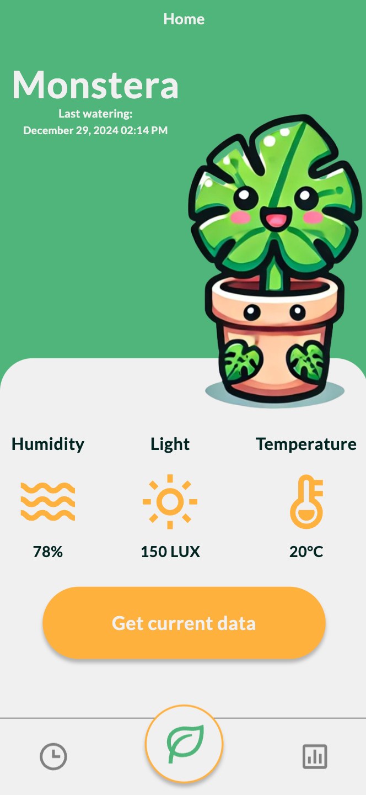
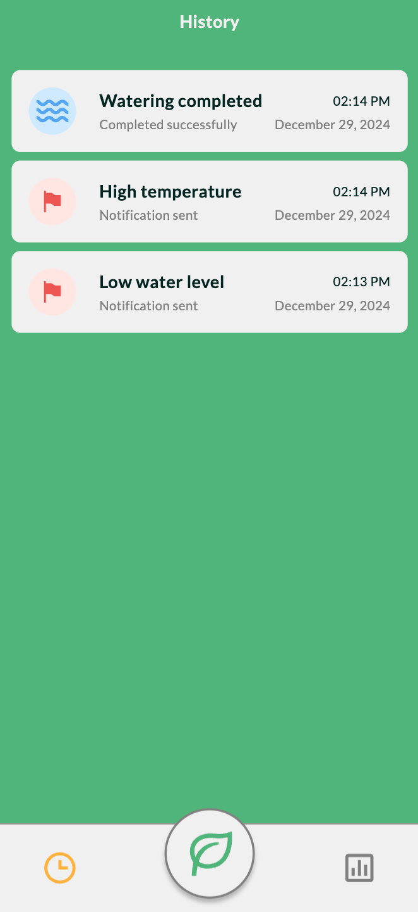
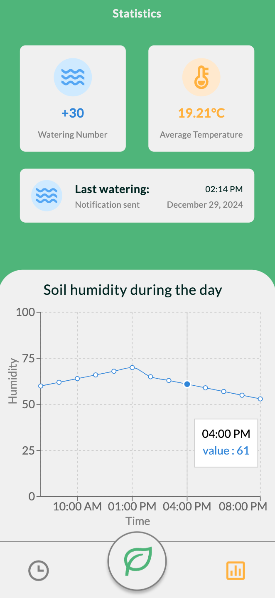
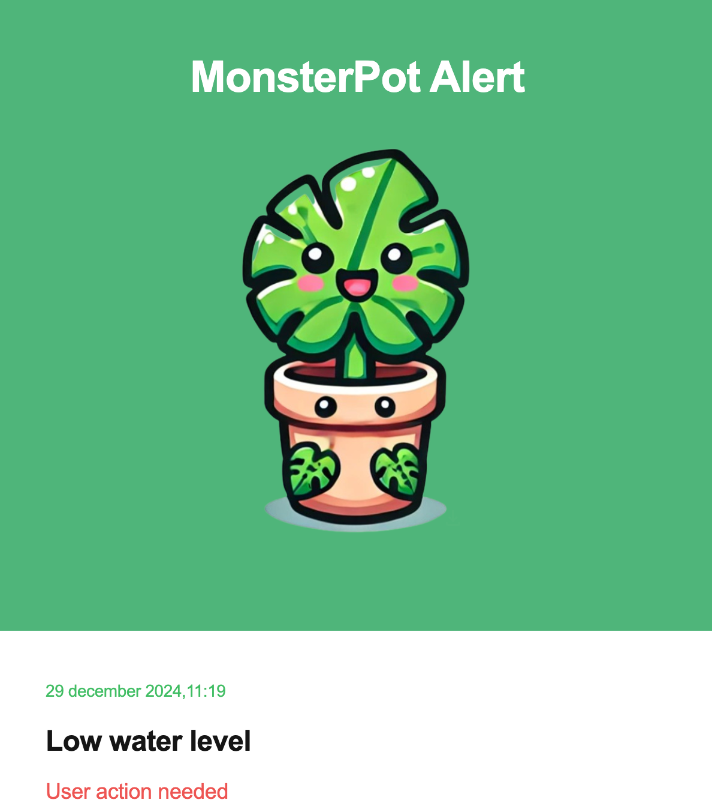

# MonsterPot 🌱

**MonsterPot** is an intelligent plant pot system that helps monitor and manage plant growth conditions using advanced technology. The system is powered by Arduino for real-time sensor data collection and control. The application is built with TypeScript and React, leveraging MQTT for efficient communication between devices and a backend implemented with Express and MongoDB for data storage and processing. Additionally, MonsterPot is a Progressive Web App (PWA) enhanced with smooth animations created using Framer Motion, ensuring a seamless and engaging user experience.

---

## Features

### Core Features:
- **Sensor Data Retrieval**: View real-time data including temperature, light intensity, and soil moisture.
- **Automated Watering**: The device automatically waters the plant when the soil moisture falls below a predefined percentage threshold, ensuring optimal hydration.
- **Continuous Monitoring**: The system constantly monitors light intensity and temperature, sending real-time alerts for any critical deviations via in-app and email notifications.
- **History Section**:
  - Track the last watering date.
  - Notifications for errors such as low water level, high temperature, or insufficient light.
- **Statistics Section**:
  - Average temperature.
  - Last watering date and total number of waterings.
  - Line chart showing daily watering percentage (%).
---

## Screenshots

<table style="width:100%; text-align:center;">
  <tr>
    <td style="vertical-align:top;">
      
      <p>Main Application Screen</p>
    </td>
    <td style="vertical-align:top;">
      
      <p>History Section</p>
    </td>
    <td style="vertical-align:top;">
      
      <p>Statistics Section</p>
    </td>
    <td style="vertical-align:top;">
      
      <p>Email Alert</p>
    </td>
  </tr>
</table>


---


## Installation

1. **Clone the Repository**:
   ```bash
   git clone git@github.com:Pabiak/MonsterPot.git
   ```
2. **Install Dependencies for the Application: Navigate to the App folder and install dependencies:**
    ``` bash
    cd app
    pnpm install
    ```
3. **Setup your MongoDB and MQTT broker**

4. **In server/.env provide your credentials (current ones does not work anymore)**

5. **Install Dependencies for the Server: Navigate to the Server folder and install dependencies:**
    ``` bash
    cd server
    pnpm install
    ```

6. **Configure Firmware: In firmware/monsterpot.ino, provide your Wi-Fi credentials and MQTT broker details**

7. **Use the provided sketch and documentation to assemble the hardware components of the MonsterPot device.**

8. **Upload the firmware/monsterpot.ino code to your microcontroller with Wi-Fi support using the Arduino IDE or another compatible tool.**

9. **Run the Application: In separate terminals, run the following commands to start both the app and the server:**
    ```bash
        # Start the server
        cd server
        pnpm run dev

        # Start the app
        cd app
        pnpm run dev
    ```
## License

This project is licensed under the [MIT License](LICENSE).
